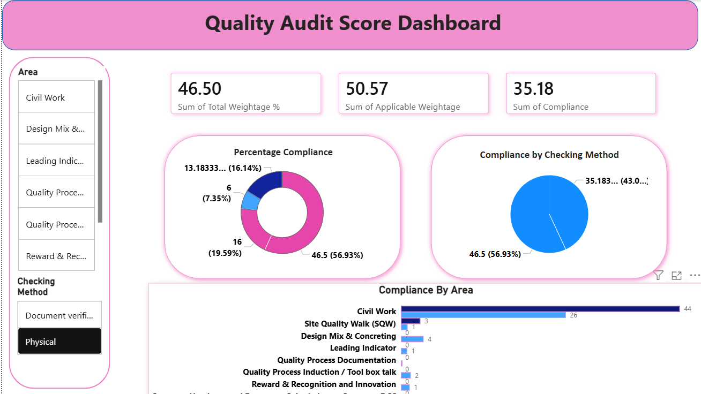

# Quality Audit Score Dashboard

## Project Overview
This project is a Quality Audit Dashboard developed using Excel, Power Query, and Power BI to monitor compliance scores and audit performance.

## Tools Used
- Microsoft Excel
- Power Query
- Power BI

## Project Workflow
1. Data Cleaning
2. Pivot Table Analysis
3. Power Query Transformation
4. Interactive Dashboard Creation

## Dashboard Features
- KPI Cards
- Compliance Analysis
- Area-wise Audit Tracking
- Interactive Filters & Slicers

## Files Included
- Raw Data Cleaning File
- Pivot Table Analysis
- Power Query File
- Power BI Dashboard (.pbix)

## Dashboard Preview

## Skills Demonstrated
- Data Cleaning
- Data Visualization
- Dashboard Design
- Business Reporting
- Power BI Development
